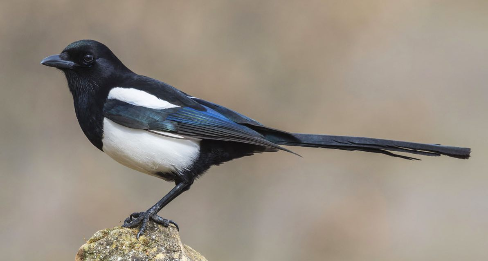
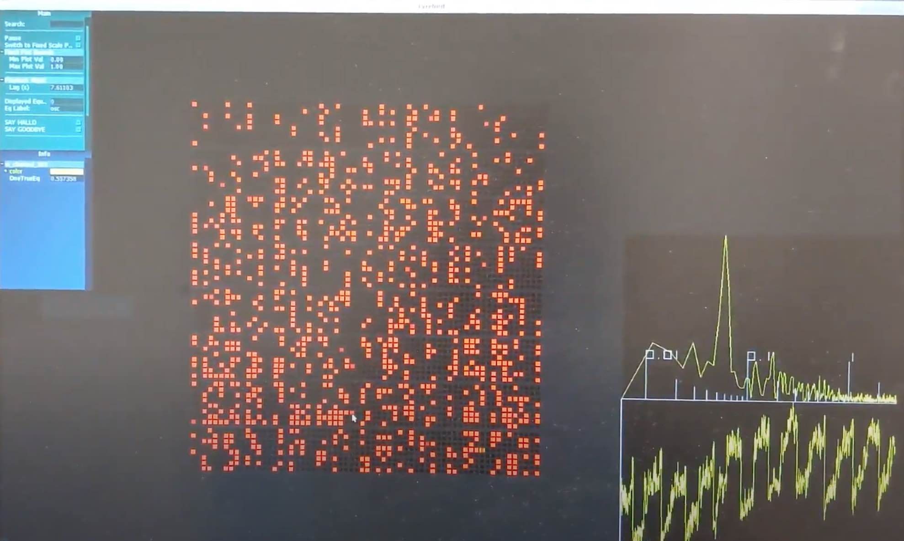
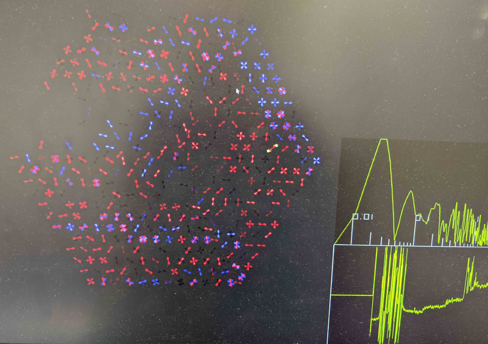

.. highlight:: rst

.. _magpie:

===============
Magpie Agent
===============



The magpie is an incredibly intelligent bird, with a decent ability to mimic
other bird calls, though not as good as `the superb lyrebird
<https://www.youtube.com/watch?v=mSB71jNq-yQ>`_. In the context of OCS, the job
of the Magpie agent is to parse data being passed from the SMuRF Streamer, and
to translate it into a stream that Lyrebird can interpret and display.

The Magpie agent should be setup and run on the same node that is running
lyrebird, which must have some sort of graphics card (either integrated or
dedicated), and must be on the same network as the smurf-server for real-time
playback.

.. argparse::
   :filename: ../agents/magpie/magpie_agent.py
   :func: make_parser
   :prog: python3 magpie_agent.py

Detector Layouts
-----------------

Grid Layout
````````````
The grid layout is a grid with 4096 elements (maximum number of channels a
single smurf slot can stream)



This layout contains 8 rows containing 512 detectors each, with the bottom
row being band 0, and the top row band 7. This is the easiest layout to set up
and is useful for viewing detector response as a function of their resonator
frequency or band / channel id.

Wafer Layout
`````````````

The wafer layout requires an input csv file that matches smurf channels
to their corresponding designed detector information such as position,
polarization angle, frequency band, etc. Currently the csv must have a row
for each detector with the following columns:

- smurf_band
- smurf_chan
- smurf freq
- vna_freq
- design_freq
- index
- mux band
- pad
- biasline
- pol
- freq
- det row
- det col
- rhomb
- opt
- det_x
- det_y
- pol_angle

This is a lot of info to collect, but there are some tools in development in 
sodetlib which can be used to generate this file from a wafer file, and Smurf
tunefile. 

Look `here <https://github.com/simonsobs/sodetlib/blob/master/scratch/jlashner/det_match.py>`_
for some useful functions if you're interested in using this layout
immediately, but this will be easier to generate once it's built into an
sodetlib module.





Configuration
--------------

Site Config
````````````
Below is the site-config entry for the magpie instance we have running at UCSD
on K2SO. We are displaying detectors using a wafer layout, determined by
a tune map csv file, with a target sample rate of 10 Hz::

    {'agent-class': 'MagpieAgent',
     'instance-id': 'magpie',
     'arguments': [
       ['--csv-file', '/config/k2so_tune_map.csv'],
       ['--layout', 'wafer'],
       ['--wafer-scale', '1'],
       ['--src','tcp://192.168.0.134:4533'],
       ['-t', '10']]},

Docker
```````
Docker-compose entry for the K2SO system::

    ocs-magpie:
        image: simonsobs/ocs-magpie:${SOCS_TAG}
        hostname: ocs-docker
        user: ocs:ocs
        network_mode: host
        container_name: ocs-magpie
        volumes:
            - ${OCS_CONFIG_DIR}:/config
            - /data:/data
        command:
            - "--site-hub=ws://${CB_HOST}:8001/ws"
            - "--site-http=http://${CB_HOST}:8001/call"
