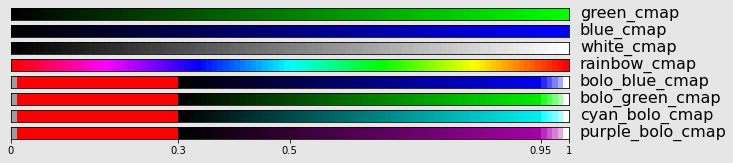
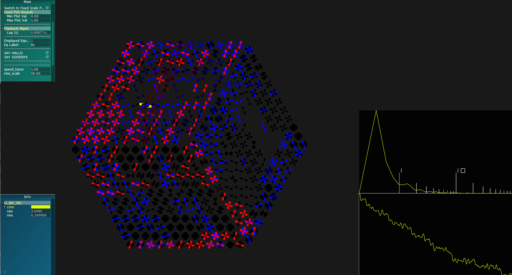

.. highlight:: rst

.. _magpie:

===============
Magpie Agent
===============

The magpie is an incredibly intelligent bird, with a decent ability to mimic
other bird calls, though not as good as `the superb lyrebird
<https://www.youtube.com/watch?v=mSB71jNq-yQ>`_. In the context of OCS, the job
of the Magpie agent is to take detector data from the SMuRF Streamer and
translate into G3Frames that are compatible with lyrebird. This requires
a small bit of pre-processing and downsampling that is done whenever a new
frame is received.

.. argparse::
   :filename: ../socs/agents/magpie/agent.py
   :func: make_parser
   :prog: python3 agent.py

Configuration File Examples
------------------------------

Below are example docker compose and ocs configuration files for running the
magpie agent.

OCS Site Config
``````````````````
Below is the site-config entry for the magpie instance we have running at UCSD
on K2SO. We are displaying detectors using a wafer layout, determined by
a detmap csv file, with a target sample rate of 20 Hz::

      {'agent-class': 'MagpieAgent',
       'instance-id': 'magpie-crate1slot2',
       'arguments': [
         '--stream-id', 'crate1-slot2',

         '--src', 'tcp://localhost:4532',

         '--dest', 8675,
         '--delay', 5,
         '--target-rate', 20,

         '--layout', 'wafer',
         # Detmap CSV file
         '--det-map', '/home/jlashner/lyrebird_demo/detmap.csv',
         '--offset', 0, 0,
         '--rotation', 0,
         '--demod-freq', 8,
         '--demod-bandwidth', 0.5
       ]},

It is  possible to tell magpie to stream data from existing G3Files instead of
directly from the smurf-stream. To do this, simply set the ``src`` argument to
be the filepath of the file you wish to stream. If you want to stream from
multiple files in series, you can do this by putting multiple source filepaths,
as is shown below. In this case, once the first file has finished streaming
magpie will immediately start streaming from the second file::

     '--src', '/path/to/file1.g3', '/path/to/file2.g3',

You can also tell the magpie agent to ignore the src argument all together and generate
fake data by adding the ``--fake-data`` argument.


Docker Compose
``````````````````

Below is an example docker compose entry for running a magpie corresponding to
crate-id 1 and slot 2. If crossbar is being run on a different server, you'll
have to modify the ``site-hub`` and ``site-http`` args accordingly::

    ocs-magpie-crate1slot2:
        image: simonsobs/socs:latest
        hostname: ocs-docker
        user: ocs:ocs
        network_mode: host
        environment:
            - INSTANCE_ID=magpie-crate1slot2
            - SITE_HUB=ws://localhost:8001/ws
            - SITE_HTTP=http://localhost:8001/call
        volumes:
            - ${OCS_CONFIG_DIR}:/config
            - /data:/data

Lyrebird
------------

Installation
``````````````

In order to build lyrebird, you first need a local build of spt3g-software.
Since we require direct access to the G3 C++ interface, unfortunately we're
not able to use the spt3g / so3g pypi package. You can follow the instructions
on `the SPT3G github page <https://github.com/CMB-S4/spt3g_software>`_ to
build.

Once that is successful, clone the simonsobs fork of
`lyrebird <https://github.com/simonsobs/lyrebird/tree/generic_datastream>`_,
and follow the build instructions on the lyrebird readme.

After lyrebird is built successfully, you'll want to add the following lines
to your bashrc:

.. code-block:: bash

   export PATH=/path/to/lyrebird/build/lyrebird-bin:$PATH
   export PATH=/path/to/lyrebird/bin:$PATH

This will add two scripts to your path:

 - ``lyrebird``, the main lyrebird executable which takes in the path to a cfg
   file specifying data vals, streamer ports, etc. and starts lyrebird from
   that
 - ``run_lyrebird`` which just takes the ports to listen to as
   command line arguments, and will use that to generate a new
   cfg file and start lyrebird from that.

Startup
``````````

To get lyrebird running, you must bring software up in the following order:

1. Make sure smurf-streamers you wish to monitor are running, though data
   doesn't have to actually be streaming
2. Bring up Magpie OCS agents. If streamers are not already running, this
   will currently fail when it begins the ``read`` process. If this happens,
   you can restart the process manually using an OCS client, or just restart
   the agent, which will begin the process on startup. Make sure each magpie
   instance you are running has a different ``stream-id`` and a different
   ``dest`` port.
3. Run lyrebird. The ``lyrebird`` executable takes in a config file that
   specifies data-vals and ports to monitor for G3Streams, but it is much
   easier to use the ``run_lyrebird`` script in the ``lyrebird/bin`` directory.
   This will generate a temporary config file determined by the arguments
   passed in, and then start lyrebird with that config file. Right now
   you need to pass in the ports that it should monitor. For instance,
   if you have two magpie agents running with ``dest`` ports 8675 and 8676,
   you can run::

      run_lyrebird --port 8675 8676

   and this will start lyrebird for the two corresponding slots.


Operation
``````````````
This section will describe the main operation of the SO fork is lyrebird.
This isn't necessary for running magpie, but this isn't well documented in
the lyrebird repo so this may be useful for future development.

On startup, lyrebird will attempt to connect to a G3NetworkSender streaming
on any ports specified in the lyrebird config file. The first frame read
from the port must be a config frame containing details on how lyrebird
should display the focal-plane.

A config file for a focal-plane with `nchans` channels will contain the
following fields:

 - ``x``: Array of len ``nchans`` with the x-coords of the visual element for
   each channel
 - ``y``: Array of len ``nchans`` with the y-coords of the visual element for
   each channel
 - ``cname``: Array of len ``nchans`` the base name for each channel. This is something
   like ``<magpie-instance-id>/channel_10``
 - ``rotation``: Array of len ``nchans`` containing how many rads each vis elem should
   be rotated (counter-clockwise) when drawn.
 - ``templates``: Array of len ``nchans`` containing the det template (defined in the
 - ``values``: Array of len ``n * nchans`` containing data values corresponding
   to a given channel. These must be unique, and are of the form
   ``<cname>/<value_name>``
 - ``eqs``: Array of len ``m * nchans`` containing the equation descriptions for
   each channel. See below for a full description, but these will be something
   like ``/ + 1 s <cname>/<valuename> 2``.
 - ``eq_labels``: Array of len ``m * nchans`` containing the labels for each
   individual equation. These are what will be displayed in the lyrebird menu
   gui, and can be something like ``osc-tod`` or ``rms``.
 - ``color_is_dynamic``: Array of len ``m * nchans`` containing bools that
   determined if the eq values should be dynamically adjusted before passing
   to the colormap. If this is False, the eq output will be sent directly to the
   colormap. If True, the eq output will first be mapped to a value in the
   range (0, 1) by interpolating between the min/max values in the lyrebird
   data buffer.
 - ``cmaps``: Array of len ``m * nchans`` containing the name of the colormap
   to use to display each equation.

Data Values
""""""""""""
**data values** are named values that lyrebird buffers and tracks internally,
and can be used in equation evaluations.

A number of data values can be stored per detector channel (as long as this
number is the same for all detector channels). So for instance if you want
to keep track of the detector TOD, rms, bias-group, and whether the channel
is flagged, you'll need to register the data values ``<cname>/tod``,
``<cname>/bg``, ``<cname>/rms``, ``<cname>/flagged`` for each detector.

Equations
""""""""""
Lyrebird can also store any number of **equations** for each detector channel.
This number can be different from the number of data values, but the number
of equations must be the same for each detector.
These equations are what are actually visualized for each channel in the
lyrebird GUI.

The equations are registered as strings in the
`Polish Notation <https://en.wikipedia.org/wiki/Polish_notation>`_. This is
a method of describing equations where the operator comes before the operands,
and is a notation that is very easy to parse and evaluate. For example, the
operation :math:`a + b` will be ``+ a b`` in polish notation, and :math:`(a +
b) / 2` can be written as ``/ + a b 2``. Operands can either be numeric values
or registered data values, including both channel-specific data values such
as ``<cname>/tod`` and global data values that are registered in the lyrebird
config variable.

Below is a full table of operators that can be interpreted by lyrebird:

.. list-table:: Lyrebird Equation Operations
   :widths: 25 25 25 25
   :header-rows: 0

   * - ``+ x y``
     - :math:`x + y`
     - ``| x y``
     - :math:`x \;\mathrm{or}\; y`
   * - ``- x y``
     - :math:`x - y`
     - ``= x y``
     - :math:`x == y`
   * - ``* x y``
     - :math:`x * y`
     - ``! x``
     - :math:`\mathrm{not}\; x`
   * - ``/ x y``
     - :math:`x / y`
     - ``& x y``
     - :math:`x \;\mathrm{and}\; y`
   * - ``% x y``
     - :math:`x % y`
     - ``c x``
     - :math:`\cos(x)`
   * - ``a x``
     - :math:`\left|x\right|`
     - ``t x``
     - :math:`\tan(x)`
   * - ``^ x y``
     - :math:`x^y`
     - ``T x``
     - :math:`\arctan(x)`
   * - ``s x``
     - :math:`\sin(x)`
     - ``q x``
     - :math:`\sqrt{x}`


For a more complex equation you might want to do something like display the
TOD value if a channel is not flagged, and if it is flagged send it to -1.
This example is done with the string::

    + * ! flagged tod * -1 flagged

which describes the equation:

.. math::

   \mathrm{tod} \times (! \mathrm{flagged}) + -1 \times \mathrm{flagged}

The displayed equation can be selected by changing the **displayed_eq** idx in the
lyrebird GUI.

Color Maps
""""""""""""

After equations are evaluated, the results will be passed to the specified
color map to determine what color the visual element should be drawn with.

Below are the colormaps available in lyrebird. Generally these take in
arbitrary floats, but will clamp them into the range [0, 1]. Along with the
standard cmaps, there are additional *bolo_cmaps*, that map different regions
of the range [0, 1] to varying colors to for different purposes. If the value
is 0 or infinite, the vis-elem will be colored grey. The range (0, 0.3) will be
colored bright red, and then the range (.3, 1) will be a gradient from black
to a base color to white as pictured below..



There are additional colormaps ``white_cmap_fs`` and ``rainbow_cmap_fs`` that
are identical to their counterparts above but instead map onto the range [-1, 1].
The colormap ``phase_cmap`` is identical to ``rainbow_cmap`` but maps the range
:math:`[0, \pi]`.


If an equation's color is set to be dynamic, each equation value will be mapped
to the range [0, 1] by interpolating between the min and max value in the
equation's data buffer. This allows you to view changes equations that span a
large range with a high dynamic-range, but makes direct channel-to-channel
comparison impossible.

Detector Layouts
-----------------

Grid Layout
````````````
The grid layout is a grid with 4096 elements (maximum number of channels a
single smurf slot can stream)

.. image:: ../_static/images/lyrebird_grid.png
  :width: 400
  :alt: Alternative text

This layout contains 8 rows containing 512 detectors each, with the bottom
row being band 0, and the top row band 7. This is the easiest layout to set up
and is useful for viewing detector response as a function of their resonator
frequency or band / channel id.

Wafer Layout
`````````````

The Wafer layout takes in a det-map CSV file generated from the simonsobs
`detmap <https://github.com/simonsobs/DetMap.git>`_ package, and uses it
to generate a focal-plane layout.



Agent API
------------------

.. autoclass:: socs.agents.magpie.agent.MagpieAgent
   :members:

Supporting APIs
------------------
.. autoclass:: socs.agents.magpie.agent.FIRFilter
  :members:

.. autoclass:: socs.agents.magpie.agent.Demodulator
  :members:

.. autoclass:: socs.agents.magpie.agent.WhiteNoiseCalculator
  :members:

.. autoclass:: socs.agents.magpie.agent.VisElem
  :members:

.. autoclass:: socs.agents.magpie.agent.FocalplaneConfig
  :members:
